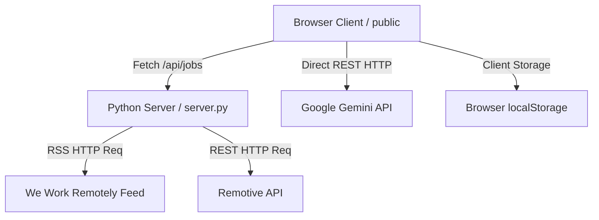

# ApexJob — Technical & User Documentation

Welcome to the official documentation for **ApexJob**, a local, privacy-centric, AI-powered **Remote Career Command Center**. 

This application fetches real-time remote job postings, performs ATS keyword matching, uses Google Gemini to tailor resumes/cover letters, and manages your application pipeline—all run locally on your system.

---

## Table of Contents
1. [System Architecture](#1-system-architecture)
2. [Security & Privacy Design](#2-security--privacy-design)
3. [User Guide: Tab Breakdown](#3-user-guide-tab-breakdown)
4. [Developer Guide: Codebase Walkthrough](#4-developer-guide-codebase-walkthrough)
5. [Installation & Setup](#5-installation--setup)
6. [Extending the Application](#6-extending-the-application)

---

## 1. System Architecture

ApexJob is designed with a **zero-dependency backend** philosophy to avoid dependency bloat and guarantee security.



### Tech Stack
* **Backend**: Python 3 standard libraries (`http.server` for routing, `urllib.request` for API calls, `xml.etree.ElementTree` for parsing RSS).
* **Frontend**: HTML5, CSS3 Custom Properties (Vanilla CSS), Vanilla JavaScript (ES6+).
* **UI styling**: Glassmorphism (semi-transparent overlays, `backdrop-filter: blur(20px)`), HSL-based color tokens, and Lucide Icons.
* **Database**: Serverless. Data is stored entirely client-side in the browser.

---

## 2. Security & Privacy Design

Security is a core design pillar of ApexJob:

1. **No Backend Database / No Data Collection**: Your application pipeline, resumes, and profiles are stored inside your browser's `localStorage`. No data is uploaded to a remote database.
2. **API Key Safety**: Your Google Gemini API key is stored locally in your browser. When generating assets, requests are dispatched directly from your browser to Google's API (`https://generativelanguage.googleapis.com`). The Python backend server never sees or logs your key.
3. **Input Sanitization**: All user-provided fields (job descriptions, titles, companies, profiles) are escaped using the HTML entity encoder (`escapeHTML()`) before being injected into the DOM, preventing Cross-Site Scripting (XSS) attacks.
4. **Supply Chain Security**: No Node packages, Python packages, or third-party web frameworks are used, eliminating supply-chain package vulnerability vectors.

---

## 3. User Guide: Tab Breakdown

### 📊 Tab 1: Command Center (Dashboard)
Your executive summary. It features:
* **Application Telemetry**: Four cards reflecting Total Tracked, Daily Target Progress, Interviews Scheduled, and Average ATS Score.
* **Daily Target Widget**: Tracks how close you are to your daily goal (default: 5 applications).
* **Recent Applications**: Clickable list of the last 5 positions you logged.
* **Quick Actions**: One-click shortcuts to other tabs.

### 💼 Tab 2: Remote Opportunities
A live feed parsing real-time listings:
* **Multi-Board Feed**: Merges jobs fetched dynamically from We Work Remotely and Remotive.
* **Entry-Level Filter**: Auto-screens titles and descriptions to display junior, entry-level, and L1/L2 support roles.
* **Direct Apply**: The **Apply Now** button points directly to the active application or hosting board link.
* **Tailor & RezPass**: Pre-populates the AI tailoring page with the job details instantly.

### 🌐 Tab 3: Board Hub
A launchpad for manual searches across 8 remote job boards (Remotive, We Work Remotely, Career Hound, Jobspresso, Dynamite Jobs, SkipTheDrive, Outsourcely, Virtual Vocations):
* **Custom Search Buttons**: Launches targeted searches for **IT Support** and **Web Development** roles.
* **Quick Log**: Type a job title, company, and URL, then click **Log Applied** to immediately log it in the pipeline.
* **Defunct Boards**: Displays outdated boards (like GitHub Jobs) as grayed out for reference.

### ✨ Tab 4: AI Application Tailoring & RezPass
The engine for customizing resumes and cover letters:
* **RezPass Gauge**: Displays an ATS match score based on keyword compliance.
* **Keyword Audit**: Highlights matches (teal) and lists missing skills (red) from the target job description.
* **AI Generation**: Integrates Google Gemini 2.5 Flash to automatically rewrite resumes and letters using the missing keywords. If no API key is specified, it gracefully falls back to heuristic matching templates.

### 📋 Tab 5: Application Pipeline (Kanban)
Tracks your ongoing applications across five stages:
* **Stages**: Wishlist ➔ Optimized ➔ Applied ➔ Interviewing ➔ Offer/Closed.
* **Drag-and-Drop**: Drag cards between columns to update status dynamically. 
* **Details**: Pipeline cards show the job title (clickable to the job posting), company, source tag, and the ATS RezPass score.

### ⚙️ Tab 6: Settings & Master Profile
Configure your parameters:
* **Gemini API Key**: Input field with visibility toggle.
* **Daily Target**: Change the daily application target count.
* **Master Profile**: Define customized summaries, skills, and experience details for 3 distinct career tracks: **IT Support & DevOps**, **Web Development**, and **Growth & AI**.

---

## 4. Developer Guide: Codebase Walkthrough

### `server.py`
The lightweight Python server.
* **`fetch_wwr_jobs()`**: Fetches XML feeds from We Work Remotely, parses tags, cleans HTML descriptions, and normalizes them.
* **`fetch_remotive_jobs()`**: Calls the Remotive REST API, translates the categories, and normalizes payload items.
* **`DualHTTPServerHandler`**: Extends Python's `SimpleHTTPRequestHandler`. Serves files under the `public/` directory and exposes a single API endpoint: `GET /api/jobs`.

### `public/index.html`
Defines the layout of the sidebar and the six glassmorphic tab panes. Includes CSS links, Google Fonts, and the Lucide icon pack.

### `public/styles.css`
A premium dark-mode styling system.
* **Custom Properties (`:root`)**: Declares HSL colors, radius variables, and animations.
* **Glassmorphism**: Done using `backdrop-filter: blur(20px); background: rgba(14, 18, 28, 0.8)`.
* **Transitions**: High-fidelity cubic-bezier transitions (`0.3s cubic-bezier(0.4, 0, 0.2, 1)`) for card hover scale, navigation pulses, and tab fades.

### `public/app.js`
Houses state, data parsing, rendering, and API interface logic.
* **`appState`**: Global state structure storing job feeds, tracker metrics, profiles, and settings.
* **`triggerATSAnalysis()`**: Local JavaScript routine that scans the job description for terms in `ATS_SKILLS_DICTIONARY` and computes a score comparing it to the user's master profile.
* **`generateTailoredAssets()`**: Dispatches REST requests to the Gemini API, updating the DOM dynamically with the results.

---

## 5. Installation & Setup

1. **Verify Git & Python**:
   Ensure you have Python 3 and Git installed.
   ```bash
   python --version
   git --version
   ```
2. **Clone the repository**:
   ```bash
   git clone https://github.com/Lucifer2325/apexjob.git
   cd apexjob
   ```
3. **Launch the server**:
   ```bash
   python server.py
   ```
4. **Open your browser**:
   Navigate to `http://localhost:8000`.

---

## 6. Extending the Application

### Adding New Search Portals to Board Hub
To add a new board or modify search links, update the `.boards-grid` container in `public/index.html`:
```html
<div class="board-card" data-source="Your Board Name" style="--board-accent:#HEXCOLOR">
    <div class="board-header">
        <span class="board-emoji">🔮</span>
        <div>
            <h4 class="board-name">Your Board</h4>
            <p class="board-desc">Short description</p>
        </div>
        <span class="status-badge active">Active</span>
    </div>
    <div class="board-actions">
        <a href="https://yourboard.com/search?q=support" target="_blank" class="btn-board-search">IT Support Jobs</a>
        <a href="https://yourboard.com/search?q=developer" target="_blank" class="btn-board-search">Web Dev Jobs</a>
    </div>
    <div class="quick-log-row">
        <input type="text" class="quick-log-title" placeholder="Job title">
        <input type="text" class="quick-log-company" placeholder="Company">
        <input type="text" class="quick-log-url" placeholder="Job Link">
        <button class="btn-quick-log">Log Applied</button>
    </div>
</div>
```

### Expanding ATS Keywords
To add new industry-specific terms for RezPass scoring, append strings to the `ATS_SKILLS_DICTIONARY` array in [public/app.js](file:///C:/Users/suraj/.gemini/antigravity/scratch/apexjob/public/app.js#L29-L35).
